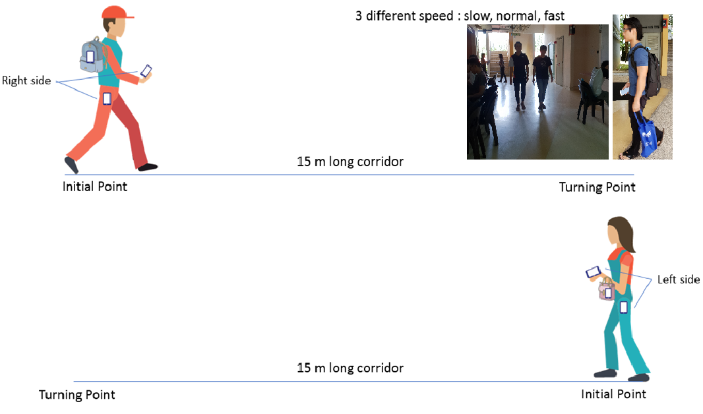

# MMUISD
Inertial Sensor Gait Database 

 Data Set Characteristics:  Multivariate, Time-Series   Sensor Type: IMU sensor (Accelerometer and Gyroscope)   Associated Tasks: Classification 

<h1> Dataset Information: </h1>

The dataset was taken in Indonesia and Malaysia. A total of 322 under-graduate IT and Engineering students (246 males and 76 females) with ages ranging from 18 – 28 years participated in the database collection process. Hundred twenty participant's data were selected randomly from the MMUISD gait database due to time constraints and made publicly available in here to contribute to the gait recognition research community. Informed consents were obtained for data collection for the ethical conduct as part of the regulation of Multimedia University. An Android application was developed to capture the data (using accelerometer and gyroscope) with 50 Hz fixed sampling rate. We also conducted an online survey to decide the sensor placement based on the participants’ top voted choices. 
 
 
 

Each of the participant was asked to install the application on their phones. The data collection process was carried out in a corridor inside the university building. The phones were fixed at six positions, i.e. left and right pocket, in a hand carry bag, in a backpack, and in the left and right hand (see Fig. 1). Each subject performed three different walking speeds: slow walk, normal walk and fast walk. The participants were told to walk naturally for the three walking speeds without any constraints. It took around 5-8 minutes for each subject to perform all the walks at 3 different walking speeds. In the transition to change the walking speed, they were asked to stop for 3 seconds at the turning points before walking back to the initial point. 

 Fig. 1: The data collection protocol with an overview of the phone positions on a participant. 

<h1> Source </h1>

 Jessica Permatasari, Dr. Tee Connie, Dr. Ong Thian Song, Multimedia University, Malaysia.   
 This dataset was collected as part of the PhD research under Multimedia University.

<h1> Attribute Information </h1>

 The data are arranged inside the folder, the name of the folder was given according to the walking speed (slow, normal and fast). Each folder contain the data from sensor position: bag, hand and pocket. Each of the folder will have 240 subject's data. The csv files are named with the userid_walkingspeed_sensor position.csv, for example: 0_fast_R4.csv will refer to the data from user id 0 with fast walking speed and right hand sensor position (see Table below).

| Notation      | Description             | 
| ------------- |:-----------------------:| 
| L             | Left                    |
| R             | Right                   |  
| 1             | pants front pocket      |
| 2             | backpack                |
| 3             | handbag or goody bag    |
| 4             | carry by hand           |

  Each file comprises the data in a matrix format, with one line per sample, and one column per channel. The channels are as follows: 
Timestamps  
x - axis accelerometer  
y - axis accelerometer  
z - axis accelerometer  
x - axis gyroscope  
y - axis gyroscope  
z - axis gyroscope  

<h1> Citation Request: </h1>

 Use of this dataset in publications must be acknowledged by referencing the following publication: 

Permatasari J., Connie T., Song O.T. (2020) The MMUISD Gait Database and Performance Evaluation Compared to Public Inertial Sensor Gait Databases. In: Alfred R., Lim Y., Haviluddin H., On C. (eds) Computational Science and Technology. Lecture Notes in Electrical Engineering, vol 603. Springer, Singapore 
 

 To access the data you may need to contact us thru email jessicajcp24@gmail.com to obtain the password and the requestor must send the release agreement signed by a legal representative of your institution (e.g., your supervisor if you are a student).
 

 This dataset under copyright of Multimedia University, Malaysia. 

